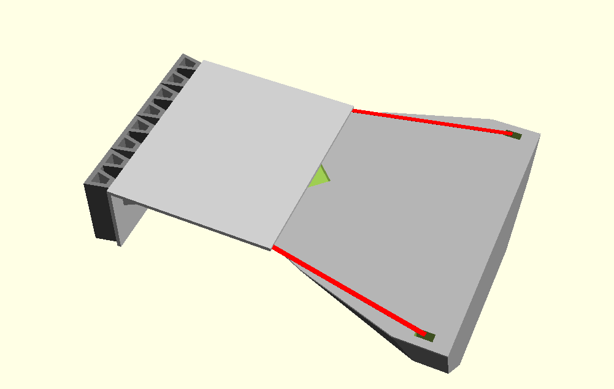
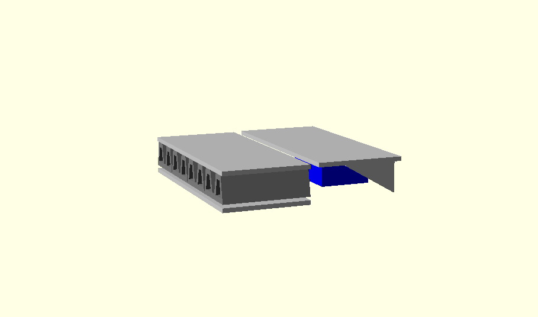

# All Aboard

This is Team HackTampa's entry in the OpenWERX "SEAL the gap: Boat Bow Bumper" challenge.

Our design concept consists of two elements: a boarding platform that sits on top of the hull and a front fender system that hangs from the front of the boarding platform.

The boarding platform is made up of two pieces (in order to fit through the hatch to the compartment it will be stowed in. Each is a welded steel frame with a deck of expanded steel. 
The bottom of the boarding platform has mounts that put [Sorbothane](http://www.sorbothane.com/) blocks in position to protect the hull from shock when vessels collide. 
The front fender system is welded steel frame holding commercial-off-the-shelf (COTS) tugbot "W" [fenders](http://www.fendertec.com/w-fenders/). 

")

